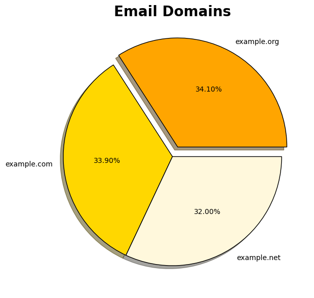

# PFDA-assignments
**Programming for Data Analytics - Assignments**

This repository contains Jupyter notebooks showcasing the assignments for the Programming for Data Analytics module. Each notebook demonstrates the use of Python libraries such as `pandas`, `numpy`, and `matplotlib` to process and visualise data in many ways.

---

## Overview

### 1. [`assignment2-weather.ipynb`](./assignment2-weather.ipynb)
This notebook visualises weather data by plotting temperature trends over time.
- Data: [weather data](data/weatherreadings1.csv)

### 2. [`assignment03-pie.ipynb`](./assignment03-pie.ipynb)
This notebook extracts email domains from a dataset and visualises the distribution domains using a pie chart.
- Data: [domain data](data/people-1000.csv)

### 3. [`assignment_5_risk.ipynb`](./assignment_5_risk.ipynb)
This notebook simulates 1,000 battle rounds of the game Risk and visualises the outcomes.

### 4. [`assignment_6_weather.ipynb`](./assignment_6_weather.ipynb)
This notebook visualises weather data by plotting temperature and windspeed trends over time.
- Data: [more weather data](https://cli.fusio.net/cli/climate_data/webdata/hly4935.csv)

---

## Getting Started

The notebooks can be run online using [GitHub Codespaces](https://github.com/features/codespaces) or on your local machine using [Visual Studio Code](https://code.visualstudio.com/) and [Anaconda](https://www.anaconda.com/download/success).

### Prerequisites
- Ensure [Git](https://git-scm.com/), Visual Studio Code and Anaconda are installed on your machine if running locally.

### Installation

1. Clone Repository
   ```bash
   git clone https://github.com/eoghanpw/PFDA-assignments.git
   cd PFDA-assignments
   ```

2. Launch Visual Studio Code

3. Run the Jupyter notebook
   - Open the repository folder in VS Code.
   - Select the desired notebook and click Run All to generate the visualisations.

---

## Usage Example

The code snippet below is extracted from the `assignment03-pie.ipynb` notebook and demonstrates how to visualise data using a pie chart.

```python
# Pie chart.
count = df["Domain"].value_counts()
labels = count.index
colours = ("orange", "gold", "cornsilk")

fig, ax = plt.subplots(figsize=(7, 7))
ax.pie(count, labels=labels, colors=colours, autopct='%1.2f%%', shadow=True,
       explode=(0.1, 0, 0), wedgeprops={"edgecolor": "k"})

ax.set_title("Email Domains", fontsize=20, fontweight="bold")

plt.show()
```


---

## References

- [pandas documentation](https://pandas.pydata.org/docs/)
- [matplotlib documentation](https://matplotlib.org/stable/index.html)
- [numpy documentation](https://numpy.org/doc/stable/)
- [Python for Data Analysis](https://wesmckinney.com/book/)
- [w3schools](https://www.w3schools.com/python/)
- [Real Python](https://realpython.com/)
- [Risk Game Rules](https://www.ultraboardgames.com/risk/game-rules.php)

---

## Author
Eoghan Walsh
